# Integrantes

- Anderson Zabala Paul Larry  
- Dominguez Leon Alex  
- Mayser Vasquez Jose Andres   
- Medina Claros Miguel Adolfo

# 1. Priorización de características de arquitectura
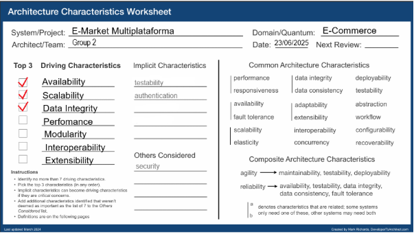

## Justificación

### Características priorizadas de la arquitectura:

1. **Availability**  
   Tomamos la disponibilidad como una de las características más importantes ya que el sistema de comercio electrónico debe estar disponible las 24/7 sin interrupciones.  
   Una caída o parada del sistema significaría pérdidas económicas por ventas no realizadas y la pérdida de confianza de los clientes.

2. **Scalability**  
   La escalabilidad es una de las características más importantes ya que el sistema debe ser estable siempre, aún en picos de tráfico muy altos.  
   Esto es crítico para el sistema ya que tendrá cargas masivas por los proveedores y una gran cantidad de usuarios navegando de forma simultánea.

3. **Data Integrity**  
   Al manejar gran cantidad de datos y transacciones, la integridad de datos es muy importante en este sistema,  
   ya que nos evitará tener problemas en los pagos, nos ayudará a manejar correctamente los catálogos y evitaremos pedidos duplicados.

# 2. Estilo Arquitectónico
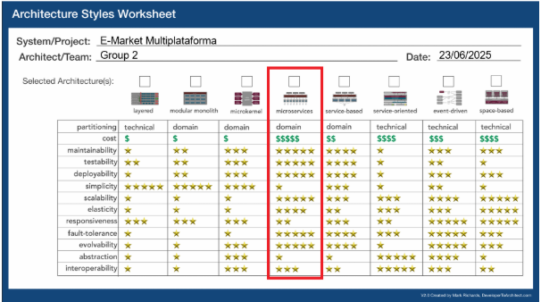

El estilo arquitectónico elegido para este sistema fue el de Microservicios, ya que, a pesar de que la integridad de datos no es su fuerte, nos permite una gran disponibilidad al tener los servicios desacoplados por lo que algún fallo en un servicio no llegaría a afectar a los demás servicios. También nos permite escalar cada servicio sin tener que afectar a otros, y nos permitirá escalar de forma horizontal cuando se necesite mejorar los recursos.
Como se menciona al comienzo, la integridad de datos no es su fuerte, pero se puede manejar orquestadores o sagas para tener una consistencia en los eventos.

# 3. Diagramas C4
## Nivel 1 Contexto del Sistema
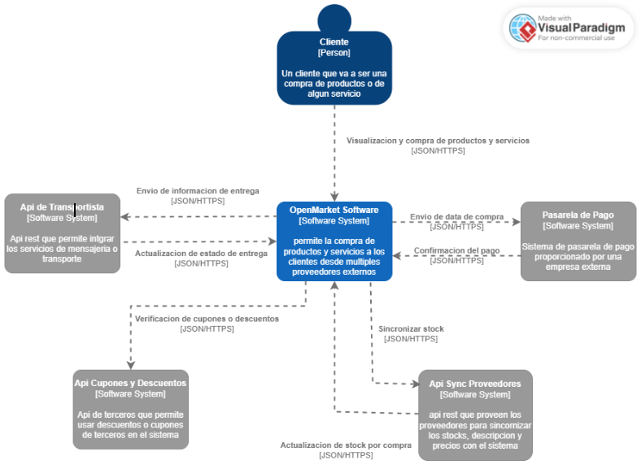

## Nivel 2 Contenedores
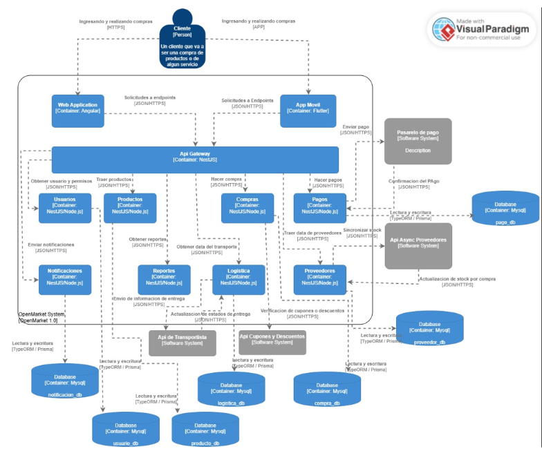

## Nivel 3 Componentes
### Componente de Logistica
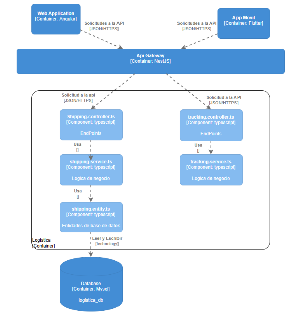

### Componente de Pedidos
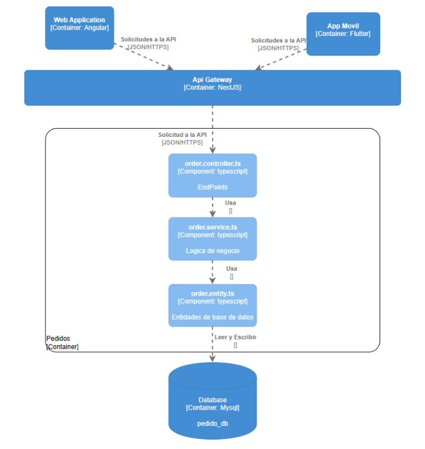

### Componente de Pagos
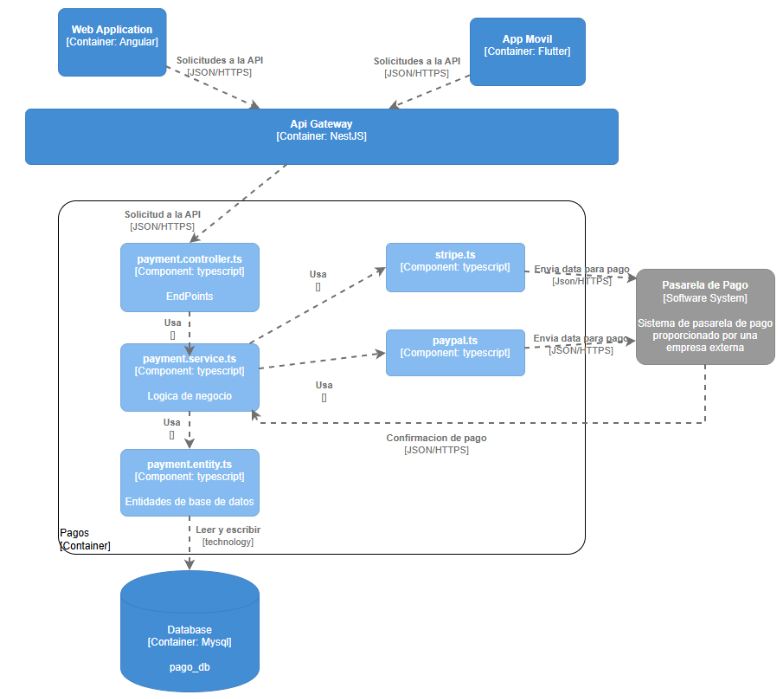

### Componente de Productos
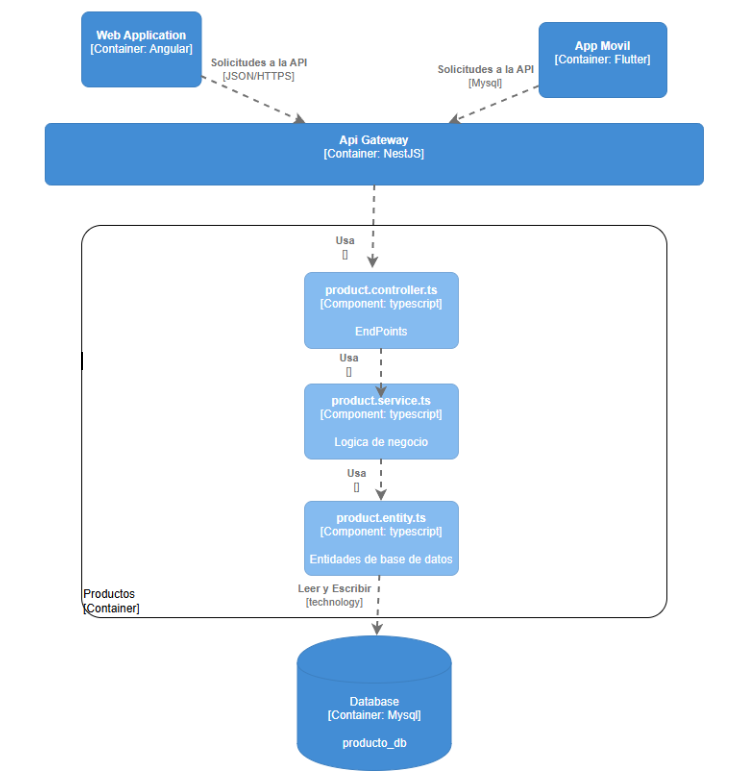

### Componente de Proveedores
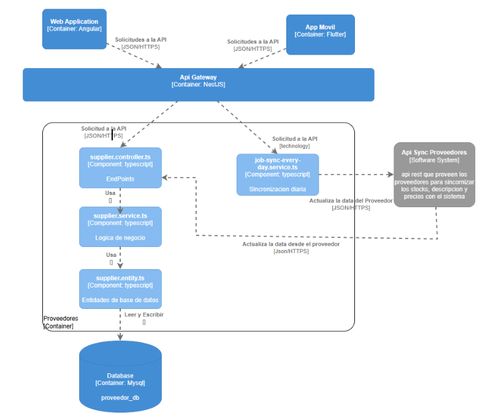

# 4. Organización del código
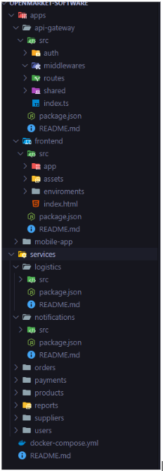
Se puede encontrar más detalle de la organización en el archivo README.md

# 5. Distancia desde la secuencia principal
## Pagos

### Caracter abstracto:
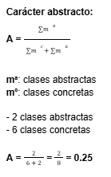

### Inestabilidad:

### Cálculo de la distancia de la secuencia principal
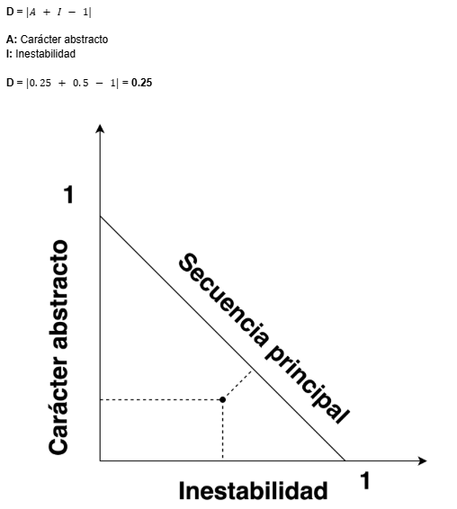